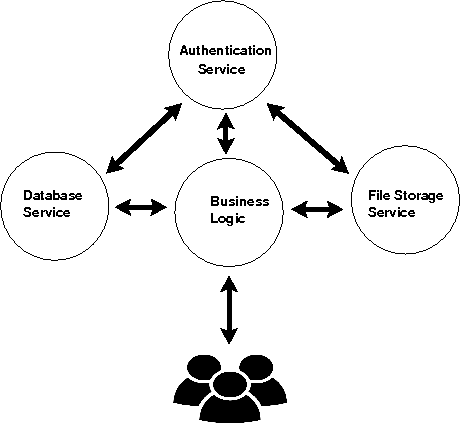
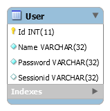
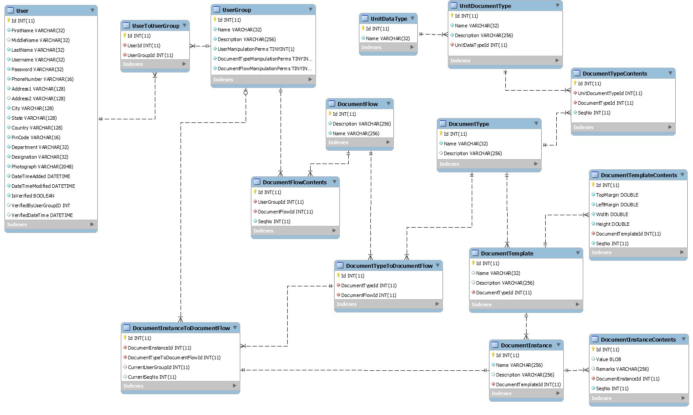
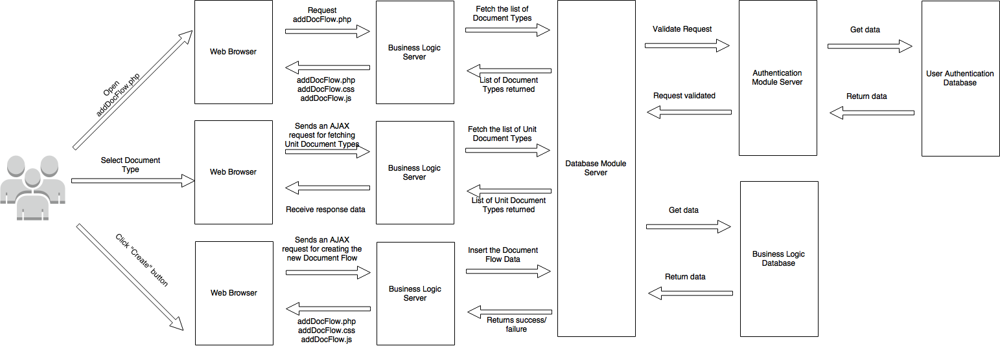

# Document-Flow-Management-System
_A web–based system to manage flow of documents between user-groups with value addition in each step using open-source technologies_

## System Design

	
## Technology:

    •  Server side: PHP5
    •  Client side: 
      •  HTML5
      •  CSS3
      •  Javascript 
      •  Jquery
    •  MySQL(RDBMS) as the database management system
    •  RPC (Remote Procedure Call) and its implementation using SOAP (Simple Object Access Protocol)
    
## Entity Relationship Diagram

For user authentication database

For business logic database

## Example Sequence Diagram
 
 
